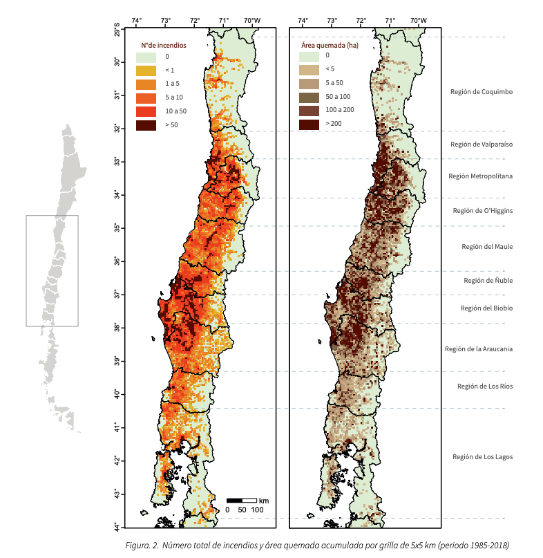
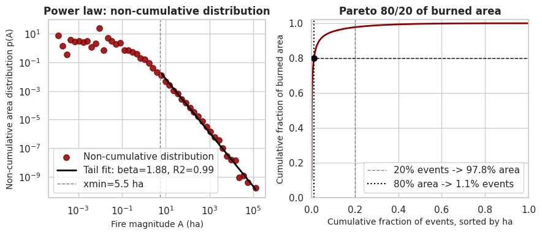

# From Spark to Catastrophe: Complete Data Documentation

> Consolidated data documentation for the *From Spark to Catastrophe* project (INF-473, UTFSM): predicting,
> conditional on an ignition having occurred, whether a wildfire will escalate to an extreme event, and
> explaining the drivers with Tree SHAP. The **source of truth** is the data pipeline in `src/` and the
> canonical dataset `data/processed/conaf_enriched_2012_2018.parquet`. This document describes that current
> 2012–2018 dataset; where methodology was first validated on a smaller pilot, the pilot is labelled
> explicitly.

This report describes the dataset assembled to study extreme wildfire behavior in Chile. The dataset
integrates three sources: the CONAF historical wildfire inventory, which provides the event anchors (ignition
location and time); the ERA5-Land reanalysis (ECMWF Reanalysis v5; ERA5-Land is its land-surface component),
which supplies the meteorological and land-surface covariates used as *ex-ante* predictors; and MODIS
(Moderate Resolution Imaging Spectroradiometer: a NASA imaging sensor aboard the Terra and Aqua satellites
that detects thermal anomalies) / FIRMS (Fire Information for Resource Management System: the NASA service
that distributes MODIS active-fire detections) active-fire detections, which provide the physically grounded
extreme-fire label following the Extreme Wildfire Event (EWE) paradigm [Tedim et al. 2018].

*Ex-ante* means **before the event**: a predictor whose value is known at or before ignition, so it carries no
post-ignition outcome information and cannot leak the target. An EWE is a fire whose behavior — intensity,
spread rate, spotting, and pyroconvection — can exceed suppression capacity [Tedim et al. 2018].

Each CONAF event is enriched by spatio-temporal matching to ERA5-Land and to MODIS/FIRMS, producing one row
per event with a strict separation between *ex-ante* predictors and post-ignition target information. The study
focuses on the four south-central regions defined below (Study Area and Regional Scope). The exploratory
analysis of burned-area concentration draws on the full CONAF historical inventory (109,947 events, 2002–2003
to 2019–2020 seasons), whereas the enrichment and label figures correspond to the modelable training window of
the **2012–2018** seasons, restricted to the four study regions, which yields **30,511 usable rows**.

---

## Study Area and Regional Scope

The study targets the south-central macrozone of Chile and is restricted to four administrative regions of
interest: Maule, Biobío, Araucanía, and O'Higgins. (Biobío here includes the present-day Ñuble Region, which
was created from it in 2018; in the 2002–2020 inventory those events are recorded under Biobío.) These regions
concentrate the large majority of the country's wildfire impact: over the 2002–2020 period they account for
**72.7%** of all recorded fire events (79,886 of 109,947) and **75.6%** of the total burned area (1,181,479 of
1,562,870 ha), as summarized in the table below [McWethy et al. 2018; Úbeda & Sarricolea 2016] and illustrated
by the figure that follows. O'Higgins and Maule are particularly relevant because they contribute a far larger
share of burned area than of event counts, indicating a concentration of high-severity fires. ERA5-Land
covariates are initially extracted over the geographic bounding box $lat \in [-42^\circ, -34^\circ]$,
$lon \in [-74^\circ, -70^\circ]$ that encloses these regions and are subsequently restricted to data within the
chosen administrative regions.

**Concentration of wildfire activity in the four study regions.** CONAF inventory, 2002–2003 to 2019–2020
seasons. Biobío includes the present-day Ñuble Region, created from it in 2018.

| Region | Events | Events % | Burned area (ha) | Burned area % |
|---|---:|---:|---:|---:|
| Maule | 10,111 | 9.2 | 386,081 | 24.7 |
| Biobío | 45,720 | 41.6 | 356,640 | 22.8 |
| Araucanía | 19,689 | 17.9 | 214,572 | 13.7 |
| O'Higgins | 4,366 | 4.0 | 224,185 | 14.3 |
| **Four study regions** | **79,886** | **72.7** | **1,181,479** | **75.6** |
| Rest of Chile | 30,061 | 27.3 | 381,391 | 24.4 |
| National total | 109,947 | 100.0 | 1,562,870 | 100.0 |

*Visual representation of fire-event concentration over a subset of Chilean territory (region selection on the
left), with a visual overlay of fire-event concentration (center) and total burnt-area concentration (right).
Note that the central administrative regions of Chile (such as Región Metropolitana and Valparaíso) are heavily
affected by fires; however, being highly urbanised areas, they exhibit wildfire behaviour that differs
substantially from the study regions.*

---

## CONAF: Historical Fire Event Records

The primary event inventory is the historical wildfire record maintained by CONAF, distributed through the
*Datos para Resiliencia* platform [CONAF, Datos para Resiliencia]. It contains 109,947 wildfire records from
2002 to 2020. Each reported ignition or fire event includes: location, ignition timing, event metadata, final
burned-area attributes, and point coordinates for the estimated ignition location. The CONAF inventory is
treated as an event anchor: latitude, longitude, and ignition time define the spatio-temporal key used to
enrich each event with meteorological and land-surface covariates. In contrast, final burned area and other
event data are recorded after the fire has developed and are therefore not valid *ex-ante* predictors.

The exploratory analysis supports the premise that wildfire impact in Chile is highly concentrated in the upper
tail. A Pareto analysis revealed that 1,240 events account for 80% of the total burned surface area,
corresponding to approximately 1.13% of all records (see figure below). The median burned area is 0.30 ha,
whereas the 99th percentile is 154.0 ha and the maximum recorded event reaches 159,812.58 ha. This asymmetry is
consistent with the self-organized criticality framing used in the forest-fire literature [Malamud et al.
1998]. A power-law distribution fit to the non-cumulative burned-area density above $x_{\min}=5.5$ ha yields a
tail exponent $\beta \approx 1.88$, where $p(A) \propto A^{-\beta}$ and $\beta$ is the negative of the log-log
slope ($R^2 \approx 0.99$).

*Important note:* This distributional evidence is used only to motivate the learning problem. Final burned area
is not the only determining factor for characterizing a mega-fire.

*Heavy-tailed structure of burned area in the CONAF wildfire records. Left: non-cumulative burned-area
distribution on log-log axes, with a power-law tail fit ($p(A) \propto A^{-\beta}$, $\beta \approx 1.88$) above
$x_{\min}=5.5$ ha. Right: Pareto concentration curve showing that 1.13% of events account for 80% of the total
burned area, while the largest 20% of events account for 97.8% of burned area.*

### CONAF Variables and Their Role

| # | Variable | Role | Use in this study |
|---:|---|---|---|
| 1 | `region` | metadata | Administrative context; may support stratified analysis. |
| 2 | `provincia` | metadata | Intermediate administrative context. |
| 3 | `comuna` | spatial key | Local administrative spatial context. |
| 4 | `temporada` | temporal key | Fire-season identifier for temporal splits and reporting. |
| 5 | `nombre` | metadata | Event name; retained for traceability, not as a predictor. |
| 6 | `fecha` | temporal key | Ignition date used to build the event timestamp. |
| 7 | `hora_inicio` | temporal key | Ignition hour used to build the event timestamp. |
| 8 | `duracion_minutos` | excluded ex-post variable | Known only after the event ends. |
| 9 | `alerta` | excluded ex-post variable | Operational response state; not available at ignition. |
| 10 | `escenario` | excluded ex-post variable | Operational/event classification; may encode later fire behavior. |
| 11 | `causa` | possible leakage | Cause attribution can be assigned after investigation. |
| 12 | `superficie_quemada_pino_a_ha` | outcome | Final burned area by fuel class. |
| 13 | `superficie_quemada_pino_b_ha` | outcome | Final burned area by fuel class. |
| 14 | `superficie_quemada_pino_c_ha` | outcome | Final burned area by fuel class. |
| 15 | `superficie_quemada_eucalipto_ha` | outcome | Final burned area by fuel class. |
| 16 | `superficie_quemada_otras_plantas_ha` | outcome | Final burned area by fuel class. |
| 17 | `superficie_quemada_arbolado_ha` | outcome | Final burned area by fuel class. |
| 18 | `superficie_quemada_matorral_ha` | outcome | Final burned area by fuel class. |
| 19 | `superficie_quemada_pastizal_ha` | outcome | Final burned area by fuel class. |
| 20 | `superficie_quemada_agricola_ha` | outcome | Final burned area by fuel class. |
| 21 | `superficie_quemada_desechos_ha` | outcome | Final burned area by fuel class. |
| 22 | `superficie_quemada_total_ha` | outcome | Final burned area; used only for descriptive analysis and the L1 proxy. |
| 23 | `latitud` | spatial key | Point coordinate for event enrichment. |
| 24 | `longitud` | spatial key | Point coordinate for event enrichment. |
| 25 | `datum` | metadata | Coordinate reference metadata. |
| 26 | `geometry` | spatial key | Geometric representation of the event point. |
| 27 | `fecha_hora_inicio` | temporal key | Local ignition timestamp in Chilean time. |
| 28 | `fecha_hora_inicio_utc` | temporal key | UTC timestamp used for ERA5-Land and FIRMS matching. |

---

## ERA5-Land: Meteorological and Land-Surface Covariates

Each CONAF event is enriched with ERA5-Land covariates at the ignition point and nearest available hourly
timestamp. ERA5 provides a physically consistent global reanalysis suitable for retrospective event
reconstruction [Hersbach et al. 2020]. The project uses variables selected for fire-weather relevance and for
consistency with recent wildfire-prediction work [Zakari et al. 2025; Liao et al. 2025]. ERA5-Land is
distributed at approximately 9 km (0.1°) horizontal resolution with hourly temporal sampling [Muñoz-Sabater et
al. 2021].

The temporal ERA5-Land variables include air temperature at 2 m altitude, dew-point temperature at 2 m
altitude, wind components at 10 m altitude, total precipitation, downward surface solar radiation, soil
temperature at four layers of depth, volumetric soil water at four layers of depth, potential evaporation,
total evaporation, evaporation from vegetation transpiration, and leaf area index for high and low vegetation.
Static land-surface covariates include soil type, land-sea mask, high- and low-vegetation cover, and high- and
low-vegetation type.

The enrichment is formulated as a nearest-neighbor extraction problem. For each event $i$, the location
$(lat_i, lon_i)$ and timestamp $t_i$ are matched to the nearest ERA5-Land grid cell and hour. Match quality is
retained separately through distance and temporal-offset fields, so downstream training can filter or audit
events with poor coverage. ERA5-Land covariates are extracted over the bounding box and administrative regions
of interest defined above. Events with coordinates outside the bounding box are flagged `out_of_coverage`, and
CONAF events outside the regions of interest are excluded from modeling.

### ERA5-Land Temporal (Hourly) Variables

The table below lists the hourly ERA5-Land variables extracted for every event. All of them are candidate
*ex-ante* predictors. Soil-related fields are resolved at the four standard ERA5-Land layers: L1 (0–7 cm), L2
(7–28 cm), L3 (28–100 cm), and L4 (100–289 cm). Precipitation, radiation, and evaporation fields are reported
as hourly accumulations in their native units.

| # | Variable | GRIB | CDS long name | Dimension |
|---|---|---|---|---|
| 1 | `t2m` | 2t | `2m_temperature` | K |
| 2 | `d2m` | 2d | `2m_dewpoint_temperature` | K |
| 3 | `u10` | 10u | `10m_u_component_of_wind` | m s$^{-1}$ |
| 4 | `v10` | 10v | `10m_v_component_of_wind` | m s$^{-1}$ |
| 5 | `tp` | tp | `total_precipitation` | m (hourly accum.) |
| 6 | `ssrd` | ssrd | `surface_solar_radiation_downwards` | J m$^{-2}$ (hourly accum.) |
| 7–10 | `stl1`–`stl4` | stl1–stl4 | `soil_temperature_level_1..4` | K |
| 11–14 | `swvl1`–`swvl4` | swvl1–swvl4 | `volumetric_soil_water_layer_1..4` | m$^3$ m$^{-3}$ |
| 15 | `pev` | pev | `potential_evaporation` | m (water eq.) |
| 16 | `e` | e | `total_evaporation` | m (water eq.) |
| 17 | `evavt` | evavt | `evaporation_from_vegetation_transpiration` | m (water eq.) |
| 18 | `lai_hv` | lai_hv | `leaf_area_index_high_vegetation` | m$^2$ m$^{-2}$ |
| 19 | `lai_lv` | lai_lv | `leaf_area_index_low_vegetation` | m$^2$ m$^{-2}$ |

### ERA5-Land Static (Invariant) Variables

The table below lists the time-invariant land-surface variables, joined to each event by spatial nearest
neighbor only. Soil type and vegetation type are integer-coded categorical fields; their full code-to-class
mappings are given in the next subsection. Land-sea mask and vegetation cover are continuous fractions in
$[0,1]$.

| # | Variable | GRIB | CDS long name | Possible values / dimension |
|---|---|---|---|---|
| 1 | `slt` | slt | `soil_type` | integer code 1–7 (see Soil-Texture Classes) |
| 2 | `lsm` | lsm | `land_sea_mask` | fraction 0–1 (dimensionless) |
| 3 | `cvh` | cvh | `high_vegetation_cover` | fraction 0–1 (dimensionless) |
| 4 | `cvl` | cvl | `low_vegetation_cover` | fraction 0–1 (dimensionless) |
| 5 | `tvh` | tvh | `type_of_high_vegetation` | integer code (see Vegetation Types) |
| 6 | `tvl` | tvl | `type_of_low_vegetation` | integer code (see Vegetation Types) |

### Static Land-Surface Classification Codes

The soil-type and vegetation-type fields are categorical integer codes inherited from the ECMWF land-surface
scheme (H-TESSEL) and are stored without remapping in the pipeline. The two tables below give the standard
code-to-class definitions used to interpret `slt`, `tvl`, and `tvh` [Muñoz-Sabater et al. 2021; Balsamo et al.
2009; van den Hurk et al. 2000; Dickinson et al. 1993]. In the Chilean subset the observed ranges are `slt` in
0–4, `tvh` in 0–19, and `tvl` in 0–17, where the code 0 denotes ocean or undefined surface.

**ECMWF H-TESSEL soil-texture classes for the `slt` field** [Balsamo et al. 2009; Muñoz-Sabater et al. 2021].

| Code | Texture class |
|---|---|
| 0 | Ocean / undefined |
| 1 | Coarse |
| 2 | Medium |
| 3 | Medium fine |
| 4 | Fine |
| 5 | Very fine |
| 6 | Organic |
| 7 | Tropical organic |

**ECMWF TESSEL/BATS vegetation types for the `tvl` (low) and `tvh` (high) fields** [van den Hurk et al. 2000;
Dickinson et al. 1993].

| Code | Vegetation type | Stratum |
|---|---|---|
| 1 | Crops, mixed farming | low |
| 2 | Short grass | low |
| 3 | Evergreen needleleaf trees | high |
| 4 | Deciduous needleleaf trees | high |
| 5 | Deciduous broadleaf trees | high |
| 6 | Evergreen broadleaf trees | high |
| 7 | Tall grass | low |
| 8 | Desert | low |
| 9 | Tundra | low |
| 10 | Irrigated crops | low |
| 11 | Semidesert | low |
| 12 | Ice caps and glaciers | -- |
| 13 | Bogs and marshes | low |
| 14 | Inland water | -- |
| 15 | Ocean | -- |
| 16 | Evergreen shrubs | low |
| 17 | Deciduous shrubs | low |
| 18 | Mixed forest / woodland | high |
| 19 | Interrupted forest | high |
| 20 | Water and land mixtures | low |

---

## Derived Meteorological Variables

Several derived variables are computed from the raw ERA5-Land fields to express meteorological mechanisms more
directly. Air and soil temperatures are converted from Kelvin to Celsius. Wind speed (WS) and wind direction
are derived from the horizontal 10 m wind components. Total precipitation is converted from meters to
millimeters. Relative humidity (RH) and vapor-pressure deficit (VPD) are derived from air temperature and
dew-point temperature using a Magnus-type saturation vapor pressure relationship.

$$T_C = T_K - 273.15, \qquad \mathit{WS} = \sqrt{u_{10}^2 + v_{10}^2}$$

$$\mathit{RH} = 100\,\frac{e_s(T_d)}{e_s(T)}, \qquad \mathit{VPD} = e_s(T) - e_s(T_d)$$

where $T_K$ is the ERA5-Land temperature in Kelvin and $T_C$ its conversion to Celsius, $u_{10}$ and $v_{10}$
are the 10 m zonal and meridional wind components, $T$ and $T_d$ denote the air and dew-point temperatures, and
$e_s(\cdot)$ is the saturation vapor pressure defined below.

These transformations preserve the *ex-ante* nature of the predictors because all inputs are meteorological or
land-surface conditions available at or before ignition.

Saturation vapor pressure uses the Magnus-Tetens approximation:

$$e_s(T) = 6.1094\,\exp\!\left(\frac{17.625\,T_C}{T_C + 243.04}\right) \quad [\text{hPa}],$$

with coefficients from Alduchov and Eskridge (1996), valid over the $-40$ to $+50\,^\circ$C range [Alduchov &
Eskridge 1996]. Relative humidity and vapor-pressure deficit are therefore reported in percent and hPa,
respectively. The table below summarizes every derived field.

**Derived meteorological variables computed from raw ERA5-Land fields.** $e_s$ is the Magnus saturation vapor
pressure (hPa).

| Output column | Formula | Inputs | Output dimension |
|---|---|---|---|
| `t2m_celsius` | $T_K - 273.15$ | `t2m` | $^\circ$C |
| `d2m_celsius` | $T_K - 273.15$ | `d2m` | $^\circ$C |
| `stl1_celsius`–`stl4_celsius` | $T_K - 273.15$ | `stl1`–`stl4` | $^\circ$C |
| `relative_humidity` | $100\,e_s(T_d)/e_s(T)$ | `t2m`, `d2m` | % (clip 0–100) |
| `vpd_hpa` | $e_s(T) - e_s(T_d)$ | `t2m`, `d2m` | hPa (clip $\geq 0$) |
| `wind_speed` | $\sqrt{u_{10}^2 + v_{10}^2}$ | `u10`, `v10` | m s$^{-1}$ |
| `wind_direction` | $(\operatorname{atan2}(-u,-v)\tfrac{180}{\pi} + 360)\bmod 360$ | `u10`, `v10` | deg (0=N, 90=E) |
| `tp_mm` | $tp \cdot 1{,}000$ | `tp` | mm |

---

## MODIS/FIRMS and Label Construction

This study considers two complementary extreme-fire labels, tested in separate experiments. First, label
**L1** is a surface-area-based mega-fire criterion that flags events whose final burned area exceeds 1,000 ha;
it is the target used by the current XGBoost baseline model and is consistent with the heavy-tailed
concentration documented above. Second, label **L2** considers a physically grounded criterion following the
Extreme Wildfire Event (EWE) paradigm (defined below).

Label L2 follows the EWE paradigm proposed by Tedim et al. [Tedim et al. 2018]. In this framing, an extreme
fire is not characterized only by its final burned area. It is a behavioral and operational process
characterized by: high fire intensity, rapid spread, spotting potential, pyro-convective behavior, and the
possibility of exceeding suppression capacity. This distinction is central for the present study: a fire can
become operationally extreme before its final size is known.

In practice, MODIS active-fire detections exposed through NASA FIRMS [NASA FIRMS] are used to apply this
concept. MODIS provides thermal anomaly detections from Terra and Aqua and reports Fire Radiative Power (FRP),
a satellite-derived measure of radiative energy release [Kaufman et al. 1998; Giglio et al. 2016]. FRP is then
converted into an estimated Fire-Line Intensity (FLI), the rate of heat release per unit length of the fire
front classically defined by Byram [Byram 1959] as $I = HWR$ [kW m$^{-1}$], where $H$ is the fuel heat yield,
$W$ the fuel consumed per unit area, and $R$ the forward rate of spread. Wooster et al. [Wooster et al. 2003,
2004] derive a *radiative* fire-line intensity by dividing the fire radiative energy release by the length of
the fire front, and note that this radiated component is only a fraction of the total heat release in Byram's
formulation. Following that framework, the implemented peak-local interpretation divides the highest matched
MODIS FRP pixel by a one-kilometer MODIS pixel-front length and rescales it by a radiant fraction to
approximate the total FLI:

$$\widehat{\mathrm{FLI}}_i = \frac{1{,}000 \cdot \mathrm{FRP}^{\mathrm{max}}_i / \eta_r}{L_p} \quad [\text{kW/m}].$$

The hat in $\widehat{\mathrm{FLI}}_i$ marks an *estimate* (the fire-line intensity is inferred from satellite
radiative power, not measured directly), the subscript $i$ indexes the fire event, $\mathrm{FRP}^{\mathrm{max}}_i$
is the maximum Fire Radiative Power (in MW) over the MODIS pixels matched to event $i$, $\eta_r$ is the
dimensionless radiant fraction (the fraction of the total heat released by the fire that is emitted as thermal
radiation, typically 0.15–0.20; the remainder is lost by convection and conduction), and $L_p$ is the MODIS
pixel-front length. In the current implementation $\eta_r = 0.17$ and $L_p = 1{,}000$ m. The binary L2 target
is defined as:

$$
y^{\mathrm{L2}}_i = \mathbf{1}\!\left[
\begin{array}{l}
\widehat{\mathrm{FLI}}_i \geq 10{,}000\ \text{kW/m} \\
\wedge\ N^{\mathrm{MODIS}}_i > 0 \\
\wedge\ A_i \geq 50\ \text{ha}
\end{array}
\right].
$$

where $y^{\mathrm{L2}}_i \in \{0,1\}$ is the L2 label of event $i$, $\mathbf{1}[\cdot]$ is the indicator
function, $N^{\mathrm{MODIS}}_i$ is the number of MODIS active-fire detections matched to the event, and $A_i$
is its final burned area in hectares. The 10,000 kW/m threshold corresponds to the category-5+ operational EWE
boundary discussed by Tedim et al. [Tedim et al. 2018]. The MODIS detection guard requires at least one valid
active-fire match. The additional minimum-area guard is used only to reduce false positives caused by spatial
matching to an adjacent large fire; it does not turn final burned area into a model feature.

*Methodological note.* CONAF, through the Horizon 2020 FIRE-RES initiative, adopts an operational
classification of wildfire events into seven categories based on measurable behavior parameters — fire-line
intensity, rate of spread, flame length, pyroconvective activity, and spotting distance — in which the
category-5+ Extreme Wildfire Event boundary corresponds to the 10,000 kW/m threshold used here [Saavedra et al.
2024; Tedim et al. 2018]. This operational framing motivates future field annotation of those parameters, which
would let the EWE concept be assessed directly rather than inferred from MODIS FRP alone, instead of replacing
the MODIS/FIRMS target in the current retrospective dataset.

The MODIS/FIRMS fields produced by the matching step are retained in the enriched table only for target
construction and audit. The table below lists them together with the matching and conversion parameters. All of
these columns are excluded from the predictor matrix because they encode post-ignition satellite information.

**MODIS/FIRMS audit columns** retained for target construction and excluded from the predictor matrix.

| Column | Dimension | Description | Exclusion reason |
|---|---|---|---|
| `modis_n_matches` | count | MODIS detections within (5 km, $\pm$24 h). | ex-post (satellite) |
| `modis_frp_max_mw` | MW | Maximum FRP among matched detections. | ex-post |
| `fli_estimado_kw_m` | kW m$^{-1}$ | Estimated FLI from FRP (Wooster et al. 2003, 2004). | ex-post / target-derived |
| `label_l2` | binary | EWE target: FRP $\geq$ 1,700 MW and area $\geq$ 50 ha. | target |

The matching and conversion constants are:

- `MATCH_RADIUS_KM` $= 5.0$ — spatial radius for matching a CONAF event to MODIS detections.
- `MATCH_TIME_HOURS` $= 24.0$ — temporal window ($\pm$24 h) around the event for a valid match.
- `RADIANT_FRACTION` $= 0.17$ — assumed radiant fraction $\eta_r$ (dimensionless).
- `MODIS_PIXEL_LENGTH_M` $= 1{,}000$ — nominal fire-front length $L_p$ (one MODIS nadir pixel), in meters.
  (Nadir is the point directly beneath the satellite, where the MODIS pixel measures $\sim$1 km; it grows
  toward the swath edges.)
- `FLI_EWE_THRESHOLD_KW_M` $= 10{,}000$ — category-5+ EWE intensity threshold, in kW/m.
- `MIN_AREA_HA_FOR_L2` $= 50$ — minimum-area coherence guard, in hectares.

The 1,700 MW FRP threshold is the FRP-domain equivalent of the 10,000 kW/m FLI boundary under the peak-local
conversion:

$$\frac{1{,}000 \cdot \mathrm{FRP}_{\mathrm{thr}}}{\eta_r \, L_p} = \frac{1{,}000 \cdot 1{,}700}{0.17 \cdot 1{,}000} = 10{,}000\ \text{kW/m}.$$

---

## Enrichment Pipeline

The data-construction pipeline starts from the cleaned CONAF event table and produces one enriched row per
event. First, local ignition date and ignition hour are combined and converted to UTC. Second, the UTC
timestamp and coordinates are used to extract ERA5-Land temporal and invariant variables. Third, derived
meteorological variables are computed from the raw ERA5-Land fields. Fourth, FIRMS active-fire detections are
queried over padded event days and matched to CONAF events within a local space-time window. Finally, label L2
is assigned from the matched FRP-to-FLI conversion, while label L1 follows directly from the CONAF burned-area
field.

This design keeps feature construction and target construction separate. ERA5-Land and static land-surface
variables form the candidate predictor set. MODIS/FIRMS fields are retained only for target auditing and are
excluded from training features.

---

## Training Dataset

The supervised learning task is defined after ignition: given a reported fire event, estimate whether it will
reach an extreme-fire threshold (either the L1 area-based or the L2 EWE label). This is aligned with fire-triage
and resource-allocation standards in which only information available at, or before, ignition is to be used
[Coffield et al. 2019]. Hence, the model is trained only on *ex-ante* predictors — location, ignition time,
ERA5-Land meteorological and derived variables, and static land-surface descriptors — enumerated in full in the
consolidated training-feature table below. Post-ignition outcomes, such as MODIS/FIRMS audit fields, and target
columns are excluded according to the role classification.

Over the modelable window — the **30,511 usable rows** across the four study regions for the **2012–2018**
seasons — the label prevalence reflects the rarity of extreme fires: the L1 area criterion ($\geq 1{,}000$ ha)
is met by **76 events** (prevalence **0.25%**), and the L2 EWE criterion ($\widehat{\mathrm{FLI}} \geq 10{,}000$
kW/m) by only **11 events** (prevalence **0.036%**). This severe class imbalance is the expected signature of
the EWE definition, under which operationally extreme fires are rare; imbalance-aware training is therefore
essential, and rare-class prediction remains one of the main challenges in *given-ignition fire-size prediction*
[Coffield et al. 2019]. (As a methodological note, the enrichment, coverage, and label workflow was first
validated on a 2016–2017 pilot subset of 8,664 events in the four regions of interest before being extended to
the full 2012–2018 window.)

The enriched parquet contains every column described in this document, including ex-post outcomes and
target-construction fields, so feature selection is applied at training time. The ignition timestamp is itself
not used as a raw feature; instead the ordinal and cyclical fields described below are derived from it.

The two labels are modeled in separate experiments: the L1 area-based criterion serves as an early, less
faithful proxy, and the L2 EWE criterion as a proxy closer to the operational extreme-fire standard. In both,
events flagged `out_of_coverage` are dropped and only the *ex-ante* predictors of the consolidated
training-feature table are used.

### Ignition-Time Temporal Features

The ignition timestamp is decomposed into ordinal and cyclical features. The day-of-year signal is encoded with
sine/cosine pairs (`doy_sin`, `doy_cos`) so that the December–January boundary is continuous.

| Column | Derivation | Range |
|---|---|---|
| `month` | timestamp.month | 1–12 |
| `hour` | timestamp.hour | 0–23 |
| `doy_sin` | $\sin(2\pi \cdot \text{day\_of\_year} / 365)$ | $[-1, 1]$ |
| `doy_cos` | $\cos(2\pi \cdot \text{day\_of\_year} / 365)$ | $[-1, 1]$ |

### Role Classification

The following role classification is applied to the enriched parquet to build the *ex-ante* predictor matrix.

| Role | Columns | Rationale |
|---|---|---|
| Included (ex-ante feature) | All ERA5-Land temporal and static variables; all derived variables; `month`, `hour`, `doy_sin`, `doy_cos`; `latitud`, `longitud`; `region`, `provincia`, `comuna` | Available at or before ignition. |
| Excluded — target | `superficie_quemada_total_ha`, `label_l1`, `label_l2`, `is_megafire` | Prediction targets and precursors. |
| Excluded — ex-post / leakage | `superficie_quemada_*` (per fuel class), `duracion_minutos`, `alerta`, `causa` | Known only after the event develops or after investigation. |
| Excluded — audit | `modis_n_matches`, `modis_frp_max_mw`, `era5_dist_km`, `era5_dt_hours`, `era5_match_quality` | Traceability of target and match quality, not predictive. |
| Excluded — metadata / id | `nombre`, `temporada`, `datum`, `geometry`, raw timestamp columns | Identifiers and non-predictive metadata. |

### Consolidated Ex-Ante Training Feature Set

The predictors fed to the model, grouped by source. Post-ignition, target, audit, and metadata columns (see
Role Classification) are excluded. The set comprises **45 ex-ante features**.

| Group | # | Columns | Reference |
|---|---|---|---|
| Location | 5 | `latitud`, `longitud`, `region`, `provincia`, `comuna` | --- |
| Ignition time | 4 | `month`, `hour`, `doy_sin`, `doy_cos` | Ignition-Time Temporal Features |
| ERA5-Land temporal | 19 | `t2m`, `d2m`, `u10`, `v10`, `tp`, `ssrd`, `stl1`–`stl4`, `swvl1`–`swvl4`, `pev`, `e`, `evavt`, `lai_hv`, `lai_lv` | ERA5-Land Temporal Variables |
| ERA5-Land static | 6 | `slt`, `lsm`, `cvh`, `cvl`, `tvh`, `tvl` | ERA5-Land Static Variables |
| Derived meteorological | 11 | `t2m_celsius`, `d2m_celsius`, `stl1_celsius`–`stl4_celsius`, `relative_humidity`, `vpd_hpa`, `wind_speed`, `wind_direction`, `tp_mm` | Derived Meteorological Variables |
| **Total** | **45** | | |

---

## Limitations

The proposed dataset inherits limitations from both administrative fire records and remote sensing. CONAF
provides high-value historical event information, but several variables are ex-post operational summaries rather
than conditions known at ignition. ERA5-Land offers spatially and temporally consistent meteorology, but it
cannot resolve all local wind, fuel, and topographic effects that influence rapid spread. MODIS/FIRMS provides
historical active-fire detections and FRP, but detections depend on overpass time, cloud and smoke conditions,
pixel geometry, and sensor saturation or omission in small fires.

Label L2 carries a specific methodological caveat: Wooster et al. [Wooster et al. 2003, 2004] show that, in
terms of radiation, derived fire-line intensity requires resolving the complete fire front, which is not
directly possible from MODIS because the coarse pixels detect only small groups of hot pixels rather than
entire fronts. The implemented peak-local interpretation — the hottest matched FRP pixel divided by a nominal
one-kilometer front length $L_p$ — together with the fixed radiant fraction $\eta_r = 0.17$ are therefore
project assumptions, not direct measurements. Accordingly, L2 should be read as a physically motivated screening
proxy for extreme fire behavior rather than a calibrated intensity measurement, consistent with the very small
number of events crossing the threshold.

For Chile, prior work emphasizes that fire activity is shaped by climate, land cover, plantation structure,
human ignition patterns, and regional bioclimatic gradients [McWethy et al. 2018; Úbeda & Sarricolea 2016]. The
present dataset captures only part of this causal structure.
